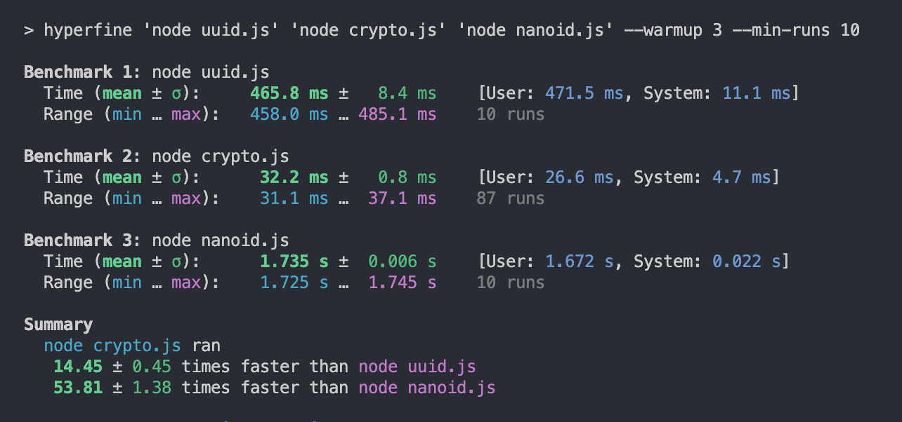

### What?
Comparing the performance of native Node.js crypto utility vs libraries NanoID and UUID (v4).

### Why?
We may reach for certain libraries because "everyone uses it" without asking <i>what is the tradeoff?</i>

### How?
Created three scripts that all work the same: import the utility and then run it 10 million times.

```js
const { utility } = await import('...');

for (let i = 0; i < 10000000; i++) {
    utility();
}
```

Then I used hyperfine to run each script at least 10 times and take the average.

```bash
hyperfine 'node uuid.js' 'node crypto.js' 'node nanoid.js' --warmup 3 --min-runs 10
```

### Specs
Computer: MacBook Pro (16-inch, 2021)
OS: macOS Ventura 13.4.1
Chip: Apple M1 Pro
RAM: 16 GB

### Result


### Demo

